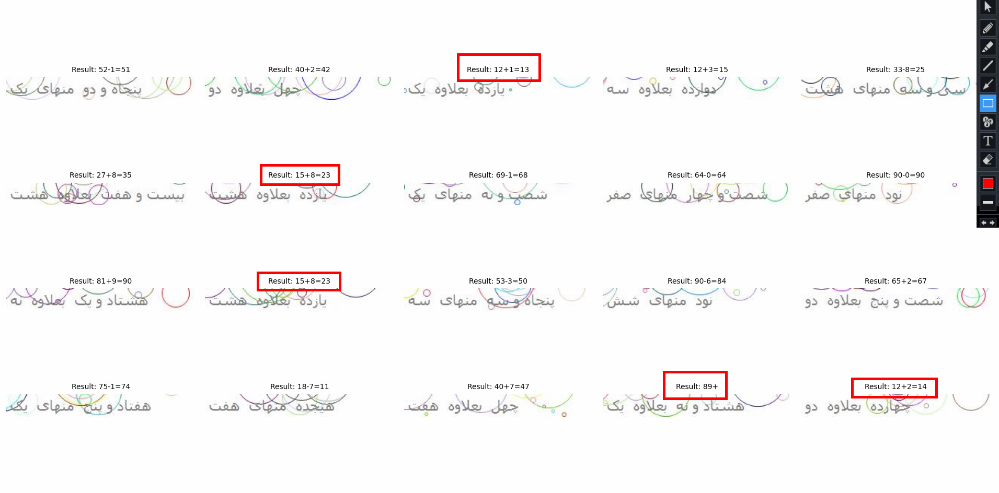

<div align="center">
  <a href="https://github.com/AmireNoori/SVG-Captcha-Solver">
    
  </a>

  <h3 align="center">Persian Captcha Solver</h3>

  <p align="center">
    A great tool for solving Persian math captchas ! 
  </p>
</div>


<details>
  <summary>Table of Contents</summary>
  <ol>
    <li>
      <a href="#about-the-project">About The Project</a>
    </li>
    <li>
      <ul>
        <li><a href="#installation">Installation</a></li>
      </ul>
    </li>
    <li><a href="#usage">Usage</a></li>
    <li><a href="#examples">Examples</a></li>
    <li><a href="#license">License</a></li>
    <li><a href="#contact">Contact</a></li>
  </ol>
</details>


## About The Project

  

The built-optimized model for this type of captcha is using ONNX.

The Open Neural Network Exchange is an open-source artificial intelligence ecosystem of technology companies and research organizations that establish open standards for representing machine learning algorithms and software tools to promote innovation and collaboration in the AI sector. ONNX is available on GitHub.

 

[Repo](https://github.com/onnx/onnx)

### Installation

1. Clone the repo
   ```sh
   git clone https://github.com/AmireNoori/PersianCaptchaSolver
   ```

You must have installed `onnxruntime>=1.15.0` library.for GPU support install : `onnxruntime-gpu`.

you can install all the libraries using the `requirements.txt` file by entering the following command in the terminal.


Captcha solving speed using this library is less than 1 second in normal systems, as a result you will not need gpu ! 
Also, the size of the model is less than a few megabytes.

The accuracy of the model is between 75% and 90% .


2. Install packages
   ```sh
   cd PersianCaptchaSolver
   pip install -r requirements.txt
   ```

## Usage

This tool is written in the form of a library that you can easily import and use in your robot or program.

* An example of how to use :

_Create a `main.py` file and enter the following codes in it._

* Example
  ```sh
  from PersianCaptchaSolver import CaptchaSolver

  captcha_path = "captcha.jpg" #Captcha Image Path
  extracted_text , result = CaptchaSolver.Solve(captcha_path)

  print(extracted_text) # 8+4
  print(result) # 12

  ```
* Terminal
  ```sh
  python main.py
  ```

## Examples

This screenshot is an example of the results obtained from the 20 captcha images shared for you

<div align="center">
    
</div>

As you can see in the picture, there are some mistakes in the results.
For example, in some images, the program calculates the answer incorrectly due to the similarity between the words `یازده` and `پانزده`.
If you are make a web script using seleinum or other tools that uses this library, you can solve this problem by creating an error handling or `try` , `except` block.
For example, in 15+8=23 :
If the `23 ` entered on the web page was wrong, use the `extracted_text` variable to replace the number `11` with the number `15` and calculate the answer again.

## License

This project is licensed under the [MIT License](LICENSE).

### MIT License

MIT License

Copyright (c) [2024] [Amir Noori]

Permission is hereby granted, free of charge, to any person obtaining a copy
of this software and associated documentation files (the "Software"), to deal
in the Software without restriction, including without limitation the rights
to use, copy, modify, merge, publish, distribute, sublicense, and/or sell
copies of the Software, and to permit persons to whom the Software is
furnished to do so, subject to the following conditions:

The above copyright notice and this permission notice shall be included in all
copies or substantial portions of the Software.

THE SOFTWARE IS PROVIDED "AS IS", WITHOUT WARRANTY OF ANY KIND, EXPRESS OR
IMPLIED, INCLUDING BUT NOT LIMITED TO THE WARRANTIES OF MERCHANTABILITY,
FITNESS FOR A PARTICULAR PURPOSE AND NONINFRINGEMENT. IN NO EVENT SHALL THE
AUTHORS OR COPYRIGHT HOLDERS BE LIABLE FOR ANY CLAIM, DAMAGES OR OTHER
LIABILITY, WHETHER IN AN ACTION OF CONTRACT, TORT OR OTHERWISE, ARISING FROM,
OUT OF OR IN CONNECTION WITH THE SOFTWARE OR THE USE OR OTHER DEALINGS IN THE
SOFTWARE.

© [Amir Noori](https://github.com/AmireNoori)

## Contact

Amir Noori - [@AmireNoori1](https://t.me/AmireNoori1) - noorifardam@gmail.com

Project Link: [https://github.com/AmireNoori/PersianCaptchaSolver](https://github.com/AmireNoori/PersianCaptchaSolver)

Thank you if this tool was useful for you and you used it, give it a star ⭐ and make me happy by following my profile❤️.
